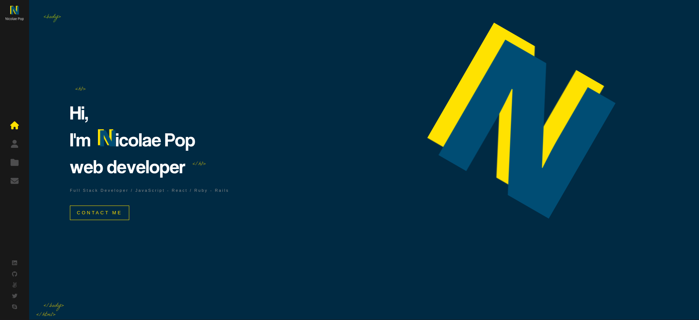

# Portfolio

> This is my portfolio website revealing my skills and projects. Built with React, JavaScript and SCSS.

## Built With

- Major language: JavaScript;
- Framework: React;
- Technologies used: SCSS, Linters, Prettier, Git, GitHub, Netlify;

## Live Demo

[Live Demo Link - netlify](https://www.nicolaepop.me/)

👤 **Nicolae Pop**

- GitHub: [@nicupop729](https://github.com/nicupop729)
- Twitter: [@nicupop729](https://twitter.com/nicupop729)
- LinkedIn: [LinkedIn](https://www.linkedin.com/in/nicolae-pop/)

## 🤝 Contributing

Contributions, issues, and feature requests are welcome!

Feel free to check the [issues page](https://github.com/nicupop729/portfolio-nicolae-pop/issues).

## Show your support

Give a ⭐️ if you like this project!

## 📝 License

This project is [MIT](./MIT.md) licensed.
